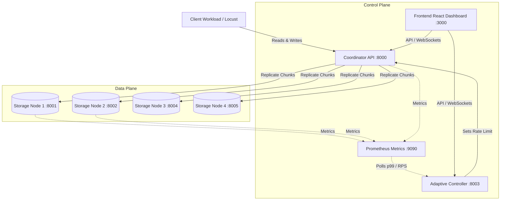

# Adaptive Storage Recovery System

> **Distributed Storage Replica Recovery Without Slowing Foreground Client Traffic**

A distributed chunked storage prototype featuring a closed-loop **Adaptive Feedback Controller** that dynamically throttles background data reconstruction based on live client latency (`p99`) and throughput.

---

## Repository Structure

The project is decoupled into two clean, self-contained parts:

```
adaptive-storage-recovery-clean/
├── frontend/                     # React 19 + Vite + TailwindCSS Observability Dashboard
│   ├── src/                      # UI components, pages, real-time charts
│   ├── public/                   # Static assets & icons
│   ├── package.json              # Frontend npm dependencies
│   ├── vite.config.ts            # Vite config with API reverse proxy
│   ├── Dockerfile                # Production Nginx container
│   ├── .gitignore                # Node/Vite ignore rules
│   └── README.md                 # Frontend documentation
│
├── backend/                      # Python Distributed Microservices
│   ├── coordinator/              # Metadata catalog & Recovery Worker daemon
│   ├── controller/               # Adaptive Feedback State Machine
│   ├── storage_node/             # Physical chunk storage daemons (.blk files)
│   ├── recovery/                 # Token Bucket rate limiter & streaming
│   ├── client/                   # Locust traffic generator & batch scripts
│   ├── monitoring/               # Prometheus configuration
│   ├── tests/                    # Pytest test suite
│   ├── requirements.txt          # Python dependencies
│   ├── run_backend.py            # Standalone backend orchestrator
│   ├── .gitignore                # Python & data ignore rules
│   └── README.md                 # Backend documentation
│
├── docker-compose.yml            # Multi-container orchestration (Backend + Prometheus + Grafana)
├── run_local.py                  # All-in-one local orchestrator (Backend + Frontend)
├── .gitignore                    # Root repository ignore rules (prevents large files & secrets)
└── README.md                     # Main documentation & GitHub deployment guide
```

---

## System Architecture



---

## Quickstart: Running Locally

### Option A: All-in-One (Recommended)
Run both the backend microservices and the frontend dashboard with a single command:

```cmd
cd adaptive-storage-recovery-clean
python run_local.py
```

Once running:
- **Frontend Dashboard:** [http://localhost:3000](http://localhost:3000)
- **Coordinator Swagger Docs:** [http://localhost:8000/docs](http://localhost:8000/docs)
- **Controller Swagger Docs:** [http://localhost:8003/docs](http://localhost:8003/docs)

*To stop all services: Press `Ctrl + C`.*

---

### Option B: Running Separately

#### 1. Start the Backend:
```cmd
cd adaptive-storage-recovery-clean\backend
python run_backend.py
```

#### 2. Start the Frontend:
In a separate terminal:
```cmd
cd adaptive-storage-recovery-clean\frontend
npm install
npm run dev
```

#### 3. Run Client Workload (Optional):
In a separate terminal:
```cmd
cd adaptive-storage-recovery-clean\backend
client\start_workload.bat LOW 60
```

---

## Pushing to GitHub (Step-by-Step)

This reconstructed project is pre-configured with complete `.gitignore` files to ensure no unwanted files (`node_modules/`, database files, chunk blocks, or virtual environments) are uploaded.

### 1. Initialize Git in the clean project folder
Open CMD in the clean folder:

```cmd
cd c:\Users\kakum\Desktop\capstone\adaptive-storage-recovery-clean
git init
```

### 2. Stage and commit all files
```cmd
git add .
git commit -m "feat: Initial commit - Reconstructed frontend and backend architecture"
```

### 3. Link to your GitHub Repository and Push
Create an empty repository on [GitHub](https://github.com/new) (e.g., `adaptive-storage-recovery`), then run:

```cmd
git branch -M main
git remote add origin https://github.com/<YOUR_GITHUB_USERNAME>/<YOUR_REPOSITORY_NAME>.git
git push -u origin main
```

---

## Deployment Guide

### Deploying Frontend
- **Platform:** Vercel, Netlify, or Cloudflare Pages.
- **Root Directory:** `frontend`
- **Build Command:** `npm run build`
- **Output Directory:** `dist`
- **Environment Variables:**
  - `VITE_COORDINATOR_URL`: Remote URL of Coordinator API
  - `VITE_CONTROLLER_URL`: Remote URL of Controller API

### Deploying Backend
- **Platform:** Docker, Render, Railway, AWS ECS, or any Linux VPS.
- **Docker Compose:**
  ```cmd
  docker compose up --build -d
  ```
- Individual containers can also be built using their respective `Dockerfile`s in `backend/coordinator`, `backend/controller`, and `backend/storage_node`.
